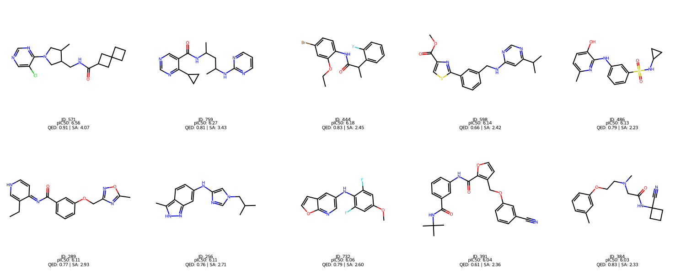

# Генерация и отбор молекул при помощи - [GP-molformer](https://github.com/IBM/gp-molformer)
[Colab](https://colab.research.google.com/drive/1fA681_j_1QyWtxUBHf16QMA4e1-AewQD#scrollTo=1fOJa1fHbjlX)




## 1. Генерация и валидация молекул
Молекулы были сгенерированны при помощи модели [ibm-research/GP-MoLFormer-Uniq](https://huggingface.co/ibm-research/GP-MoLFormer-Uniq) - безусловная de novo генерация. Скрипт `molformer\scripts\unconditional_generation.py`

Сгенерировано 1000 молекул, валидация проводилась путем возможности ковертации в `MOL`, 2 молекулы не прошли валидацию
```python
valid_df = df[df["SMILES"].apply(lambda x: Chem.MolFromSmiles(x) is not None)]
```

## 2. Проверка на токсичность
Оценка токсичности проводилась при помощи фильтров по трем фрагментам
1. PAINS (Pan-Assay Interference Compounds)
2. BRENK (Brenk Filters)
3. ZINC (ZINC Leads-Now Filter)
4. 
После фильтрации на токсичность осталось 678 молекул

|index|SMILES|MOL|TOXITY|TOXITY\_SOURCE|
|---|---|---|---|---|
|0|COCc1c\(C\(=O\)N\(CC\(C\)C\)CC\(C\)C\)cnn1-c1ccccc1||false||
|1|CCCCCCNCCC1CN\(C\(=O\)C2CN3CCC2CC3\)CC1C||true|Aliphatic\_long\_chain|
|2|COc1ccc2c\(C\)cc\(N3CCc4nnc\(Cn5cccc5\)n4CC3\)nc2c1||false||
|3|CC1C\(NCCOc2ccc\(NC\(=O\)CCOc3ccc\(Cl\)cc3\)cc2N\)CC2CC21\.Cl\.Cl||true|Aliphatic\_long\_chain|
|4|COc1cc\(Oc2ccccc2\)ccc1NC\(=O\)C\(C\)NC1CC1||false||

## 3. Оценка свойств
### 3.1 Дескрипторы
Бали посчитаны базовые дескрипторы
> MW (MolWt): Молекулярная масса
> 
> HA (Heavy Atoms): Количество тяжелых атомов
> 
> LogP: Липофильность (жирорастворимость)
> 
> PSA: Полярная площадь поверхности
> 
> HBA (NumHAcceptors): Количество акцепторов водородной связи
> 
> HBD (NumHDonors): Количество доноров водородной связи
> 
> Fsp3 (Fraction CSP3): Доля атомов углерода в состоянии sp3-гибридизации
> 
> nRotB (NumRotatableBonds): Количество вращающихся связей

|index|SMILES|MOL|WA|HA|LogP|PSA|HBA|HBD|Fsp3|nRotB|
|---|---|---|---|---|---|---|---|---|---|---|
|0|COCc1c\(C\(=O\)N\(CC\(C\)C\)CC\(C\)C\)cnn1-c1ccccc1||343\.47100000000006|25|3\.7729000000000026|47\.36|3|0|0\.5|8|
|2|COc1ccc2c\(C\)cc\(N3CCc4nnc\(Cn5cccc5\)n4CC3\)nc2c1||388\.4750000000001|29|3\.0558200000000015|61\.0|5|0|0\.3181818181818182|4|
|4|COc1cc\(Oc2ccccc2\)ccc1NC\(=O\)C\(C\)NC1CC1||326\.39600000000013|24|3\.5665000000000013|59\.59|4|2|0\.3157894736842105|7|
|6|COC\(=O\)C\(Nc1ccc\(NC\(=O\)Cc2c\[nH\]c3ccccc23\)nc1\)C\(C\)C||380\.4480000000001|28|3\.353600000000002|96\.11|5|3|0\.2857142857142857|7|
|8|O=C\(COc1cccnc1\)NC\(c1ccccc1\)c1ccc2nc\[nH\]c2c1||358\.40100000000007|27|3\.2425000000000015|79\.9|4|2|0\.09523809523809523|6|

### 3.2 QED - Quantitative Estimate of Drug-likeness
Оценена похожесть на лекарство и были отобраны молекулы у которы $QED > 0.6$. Удалено 120 молекул

### 3.3 SA - Synthetic Accessibility
Оценена синтетическая доступность, были отобраны молекулы у которы $SA < 6$. Таких молекул не оказалось

### 3.4 Правило Липински
Были посчитаны нарушения правила Липиски и оставлены только те молекулы которые не нарушают ни одного правила. Таких оказалось немного - удалено 14 молекул
```python
valid_df["Lipinski"] = (valid_df["WA"] > 500).astype(np.int64) + (valid_df["LogP"] > 5).astype(np.int64) + (valid_df["HBD"] > 5).astype(np.int64) + (valid_df["HBA"] > 10).astype(np.int64) + (valid_df["nRotB"] > 10).astype(np.int64)
```

|Lipinski|count|
|---|---|
|0|544|
|1|14|

По итогу после всех отборов осталось 544 - молекулы

## 4. QSAR
В качестве мишени был выбран белок EGFR (CHEMBL203) - будем лечить рак.
EGFR (рецептор эпидермального фактора роста, HER1) — это трансмембранный белок, регулирующий рост, деление и выживание клеток. Мутации гена EGFR вызывают чрезмерную активность белка, что ведет к бесконтрольному делению клеток и развитию рака (особенно легких).

Из базы данных CHEBML были выбраны 2000 молекул которые имеют нужный таргет `target_chembl_id='CHEMBL203'`.
Получены фингерпринты при помощи `Morgan Fingerprint`, для молекул из CHEMBL и сгенерированных.
Обучен `RandomForest` и получены оценки `pIC50` - максимальная оценка $6.56$

Молекулы были отсортированы и выбрано топ-10

|index|SMILES|MOL|WA|HA|LogP|PSA|HBA|HBD|Fsp3|nRotB|QED|SA|Lipinski|pIC50\_EGFR|
|---|---|---|---|---|---|---|---|---|---|---|---|---|---|---|
|571|CC1CN\(c2ncncc2Cl\)CC1CNC\(=O\)C1CC2\(CCC2\)C1||348\.8780000000002|24|2\.8988000000000014|58\.120000000000005|4|1|1|4|0\.9085275702583889|4\.066850034716395|0|6\.557066666666665|
|759|CC\(CC\(C\)Nc1ncccn1\)NC\(=O\)c1cncnc1C1CC1||326\.40400000000017|24|2\.1529999999999996|92\.69|6|2|2|7|0\.8097180542999236|3\.42797626075118|0|6\.2672|
|444|CCOc1cc\(Br\)ccc1NC\(=O\)C\(C\)c1ccccc1F||366\.2300000000001|22|4\.7291000000000025|38\.33|2|1|1|5|0\.8310305860640425|2\.4490496311325973|0|6\.1831|
|598|COC\(=O\)c1csc\(-c2cccc\(CNc3cc\(C\(C\)C\)ncn3\)c2\)n1||368\.4620000000001|26|4\.122200000000002|77\.0|7|1|1|6|0\.6595734426613306|2\.421611194245365|0|6\.136800000000002|
|486|Cc1ccc\(O\)c\(Nc2cccc\(S\(=O\)\(=O\)NC3CC3\)c2\)n1||319\.38600000000014|22|2\.2799199999999997|91\.32000000000001|5|3|3|5|0\.786239362125921|2\.2293649713103374|0|6\.1331999999999995|
|289|CCc1c\[nH\]ccc1=NC\(=O\)c1cccc\(OCc2noc\(C\)n2\)c1||338\.367|25|2\.5886200000000006|93\.37|5|1|1|5|0\.7715696232972815|2\.929412774638182|0|6\.1119|
|256|Cc1\[nH\]nc2cc\(Nc3cn\(CC\(C\)C\)cn3\)ccc12||269\.35200000000003|20|3\.4674200000000024|58\.53|3|2|2|4|0\.7621496518636327|2\.709634823731518|0|6\.109800000000002|
|732|COc1cc\(F\)c\(Nc2cnc3occc3c2\)c\(F\)c1||276\.242|20|3\.858200000000001|47\.29|4|1|1|3|0\.7887401082649854|2\.598714985674837|0|6\.0592|
|391|CC\(C\)\(C\)NC\(=O\)c1cccc\(NC\(=O\)c2occc2COc2cccc\(C\#N\)c2\)c1||417\.4650000000002|31|4\.510880000000003|104\.36000000000001|5|2|2|6|0\.6139603353847355|2\.3554220059896664|0|6\.039800000000002|
|384|Cc1cccc\(OCCN\(C\)CC\(=O\)NC2\(C\#N\)CCC2\)c1||301\.3900000000001|22|1\.8680999999999994|65\.36|4|1|1|7|0\.8347339511685266|2\.3334789687882704|0|6\.0280000000000005|


Работа осталось за малым, завершить drug discovery провести клинические испытания и апрувнуть продакшн) 
